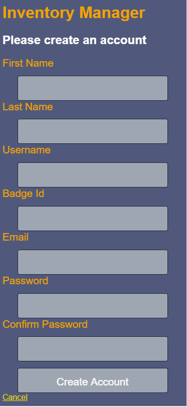
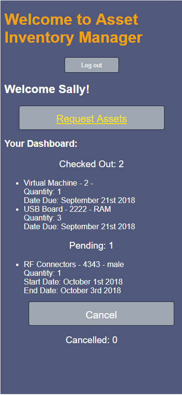
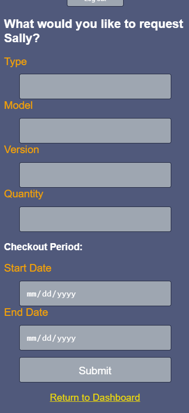
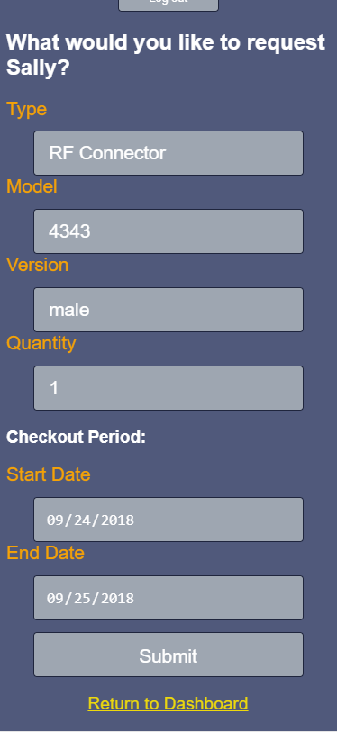
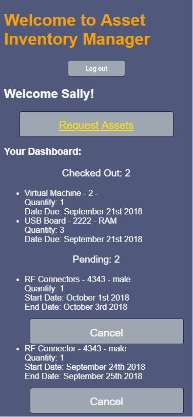
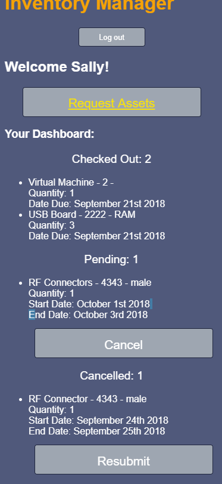
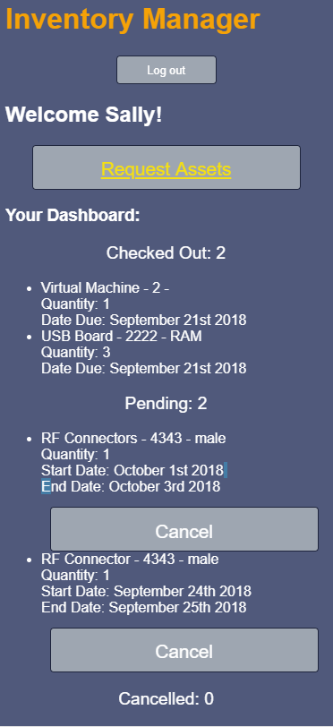

#Asset Inventory Manager
An app to simplify and automate the inventory management of the hardware assets of your company, allowing requestors one quick and easy place to request assets, see the status of their requests, as well as see the assets for which they are currently responsible/own. 

#Link to Deployed Version:
https://asset-manager-jem.herokuapp.com/

#Tech Stack:
React for the frontend
Redux for state management
Node/Express for the backend
MongoDB/Mongoose for the database
JWTs for authentication

This is the frontend for this app.  The backend can be found here: https://github.com/JemDobro/asset-manager-server.

All components live in the src directory. 
The app houses the header-bar, the landing page, the create account page, and the request page.  The header-bar is always visible.
The landing page houses the login form, and the dashboard.

###App opens with always visible header and log in form/create account

###Successfully creating account will automatically log user in, log out button will appear in header

###Successful login opens dashboard

###Clicking Request Assets opens request form

###Fill out request form and submit will add request to dashboard with a pending status

###Dashboard with new request added

###Clicking cancel on pending request will cancel the request

###Clicking resubmit on cancelled request will resubmit the request

