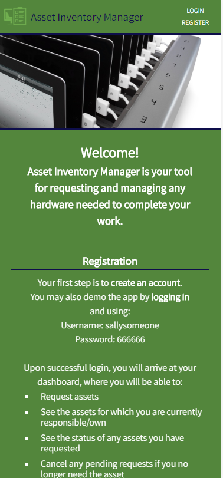
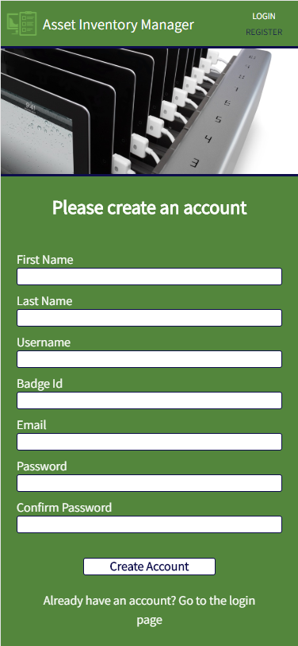
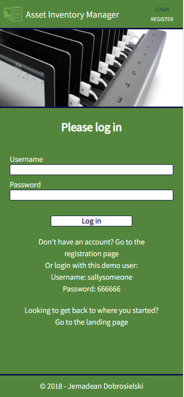
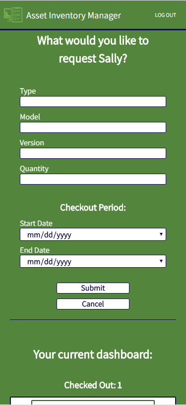

![Asset Manager Logo][logo]

[logo]: img/icon-left-font-cropped-readme.png

# Asset Inventory Manager
An app to simplify and automate the inventory management of the hardware assets of your company, allowing requestors one quick and easy place to request assets, see the status of their requests, as well as see the assets for which they are currently responsible/own. 

## Link to Deployed Version:
https://asset-manager-jem.herokuapp.com/

## Screenshots
|  |  |  |
|:---:|:---:|:---:|
| Landing Page | Registration | Login |

|  |  |  |
|:---:|:---:|:---:|
| Dashboard | Request Assets | Request Assets with Dashboard |

## Tech Stack:
### Frontend

  * HTML5
  * CSS3
  * JavaScript
  * React
  * Redux
  * Deployed to Heroku

### Backend

  * Node/Express
  * MongoDB/Mongoose/mLab
  * JWTs for authentication
  * Deployed to Heroku

This is the frontend for this app.  The backend can be found here: https://github.com/JemDobro/asset-manager-server.

All components live in the src directory. 
The app houses the navigation bar, header, the landing page, the create account page, the request page, and the footer.  
The navigation bar, header, and footer are always visible.
The landing page houses the login form, and the dashboard.

## Screenshots:
### App opens with always visible header and log in form/create account

### Successfully creating account will automatically log user in, log out button will appear in header

### Successful login opens dashboard

### Clicking Request Assets opens request form

### Fill out request form and submit will add request to dashboard with a pending status

### Dashboard with new request added

### Clicking cancel on pending request will cancel the 

### Clicking resubmit on cancelled request will resubmit the request

## To Do

  * Add nicer validation messages for user when filling in form and they miss a required field, etc.
  * Request form: drop downs of available items would be nice and remove errors
  * Date picker currently allows dates in the past to be chosen, and end date can be before start date--need some restrictions here
  * Submit button needs to give confirmation that submission was successful, and give user option to submit again by editing current info in form or clear form to start brand new
  * Improve design
  * Add ability to edit a pending request, for example to change the dates asset is needed